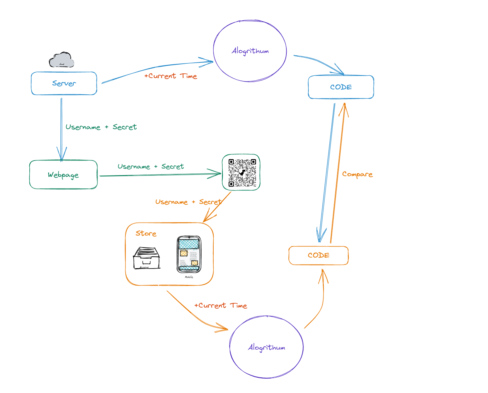

# 冷门技巧 & 疑难杂症

## 阻止浏览器加载 favicon

```html
<link rel="icon" href="data:," />
```

## Map 返回 Object 时的 Lint 问题


```jsx
const launchOptimistic = rockets.map((elem) => ({
	country: elem.country,
	launches: elem.launches + 10,
}));
```

## React 中使用 input[type=file] 的问题

```jsx
if (this.props.webkitdirectory) {
	var inputEle = ReactDOM.findDOMNode(
		this.refs.input
	) as HTMLInputElement;

	inputEle.setAttribute("webkitdirectory", "");
}
```

由于`webkitdirectory`不是 w3c 的标准属性，所以你无法在 JSX 中直接声明。

## 模拟安卓桌面滚动效果（粘性滚动）

参考 [MDN](https://developer.mozilla.org/en-US/docs/Web/CSS/scroll-snap-type)

```css
scroll-snap-type: none;
scroll-snap-type: x;
scroll-snap-type: y;
scroll-snap-type: block;
scroll-snap-type: inline;
scroll-snap-type: both;
```

## Markdown 链接变量

此方法可以让一个链接复用多次。

```Markdown

## Attribution

This Code of Conduct is adapted from the [Contributor Covenant][homepage], version 1.4,
available at https://www.contributor-covenant.org/version/1/4/code-of-conduct.html

[homepage]: https://www.contributor-covenant.org

For answers to common questions about this code of conduct, see
https://www.contributor-covenant.org/faq

```

## 判断当前页面是否存在输入事件

```js
navigator.scheduling.isInputPending();
```

这 facebook 官方贡献给 Chromium 的 api, 现在已经列入 W3C 标准(具体解释), 用于判断是否有输入事件(包括: input 框输入事件, 点击事件等)。

## Authenator (2FA) 原理

Authenticator 会保存密钥和用户名的信息，并使用共享密钥和当前时间生成每 30 秒更改一次的六位数代码。

云服务通过相同的算法，检查用户输入的代码是否与 Google Authenticator 使用共享密钥和当前时间生成的代码相匹配。

如果代码匹配，则用户被授予访问该服务的权限。



## 分割 emoji 字符串

由于 emoji 的特殊构成，直接使用 split 方法会出现问题。可以使用浏览器自带的[Intl](https://mozilia.mdn.com)来进行本地化分词。

```js
const emojis = "🫣🫵👨‍👨‍👦‍👦";

console.log(emojis.split(""));

console.log([...emojis]); // ['🫣', '🫵', '👨', '‍', '👨', '‍', '👦', '‍', '👦']

const segmenter = new Intl.Segmenter("en", {
	granularity: "grapheme",
});
const segments = segmenter.segment(emojis);

console.log(Array.from(segmenter.segment(emojis), (s) => s.segment)); // ['🫣', '🫵', '👨‍👨‍👦‍👦']
```

## PWA 显示类似应用商店的安装提示
