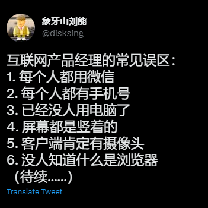

# 产品思维

软件的本质是产品，其目的是解决问题。

## 衡量产品的质量

衡量互联网产品的一个重要指标是用户留存度。

很多产品会标榜自己有多少下载量或者多少注册数，但这些并不能真实地反映出产品质量。为此我们引入了用户留存度的概念。

我们可以看看网易云音乐前产品经理给出的数据：

> 下面还有一些关于活跃用户比例的经验数据可以分享给大家。这些数据并不是某个产品的，而是从我分析数据的过程中积累下来的，是当下国内互联网上比较健康的产品（较大体量以上） 的平均数据。
•	日活跃用户数/总用户数=5%。
•	周活跃用户数/总用户数=10%。
•	月活跃用户数/总用户数=20%。
•	次日留存率=40%。
•	7日留存率=20%。
•	30日留存率=10%。
> 

有些厂商为了提高用户留存度，出现了错误的做法，例如：

- 频繁推送通知，往往还有吸引人的标题
- 使用推荐算法，不断刺激多巴胺
- 推送垃圾邮件

正确的做法应该是：

- 尊重用户
- 提供优质的内容/服务
- 设计可以促使产品传播的功能，例如邀请返利

## 如何设计产品

### 识别需求

有些需求是伪需求。

### 位用户负责

新人开发者经常会“想当然”地假设用户的访问环境：最新版本的浏览器、桌面端、超快的网络速度…事实上，这是对用户非常不负责的做法。

设计一款产品时，要考虑不同用户的不同需求，让他们有更好的体验。比如，兼容性，要考虑不同用户使用的不同浏览器，不同网络速度，不同设备，有针对性地调整，实现可以广泛使用的体验。此外，要有完善的客服服务，及时处理用户的反馈，让终端用户能得到满意的服务。
