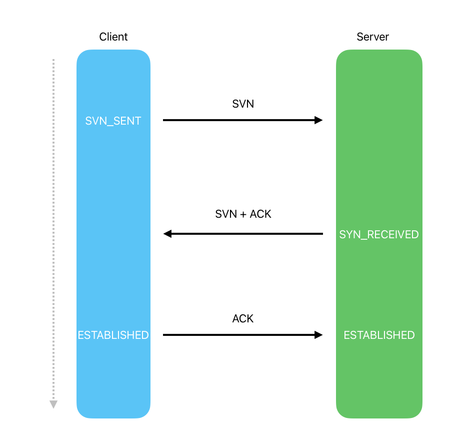
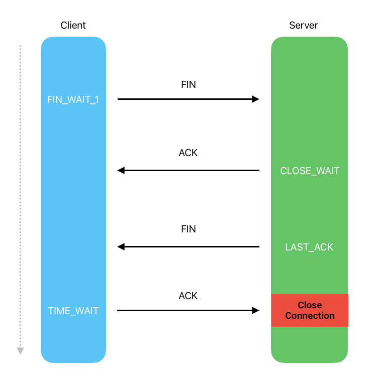

# 计算机网络

> There is no cloud. It’s just another computer.

## OSI 模型

OSI 模型是一种理论模型，将计算机网络通信协议分为 7 层。这些层从上到下依次为：应用层、表示层、会话层、传输层、网络层、数据链路层和物理层。

-   应用层：提供用户接口，为应用程序提供网络服务。
-   表示层：负责数据格式的转换。
-   会话层：管理数据交换会话。
-   传输层：提供可靠的数据传输，包括 TCP 和 UDP。
-   网络层：负责数据包的路由和转发，包括 IP 和 ICMP。
-   数据链路层：负责将数据包从一个节点传输到另一个节点，包括 ARP 和 RARP。
-   物理层：负责数据的物理传输。

注意，OSI 模型是一种理论模型，实际应用中使用的是 TCP/IP 模型。TCP/IP 协议族包括以下四个层次：

-   应用层：HTTP、FTP、Telnet、SMTP
-   传输层：TCP、UDP
-   网络层：IP、ICMP
-   数据链路层：ARP

## HTTP

HTTP 是应用层协议。

注意，HTTP 协议从未规定 GET/POST 的请求长度限制是多少。对 get 请求参数的限制是来源与浏览器或 web 服务器，浏览器或 web 服务器限制了 url 的长度。为了明确这个概念，我们必须再次强调下面几点:

-   HTTP 协议 未规定 GET 和 POST 的长度限制
-   HGET 的最大长度显示是因为 浏览器和 web 服务器限制了 URI 的长度
-   H 不同的浏览器和 WEB 服务器，限制的最大长度不一样
-   要支持 IE，则最大长度为 2083byte，若只支持 Chrome，则最大长度 8182byte

### HTTPS

HTTPS 是 HTTP 协议的安全版本。通过 SSL/TLS 加密，保证数据传输的安全性和完整性。HTTPS 使用 443 端口进行通信。

-   HTTP 协议中 GET 和 POST 请求的长度限制是由浏览器或 web 服务器限制的，而非协议本身限制。
-   常见的 HTTP 状态码中，1xx 表示信息，301 表示临时重定向，304 表示永久重定向，4xx 表示客户端错误，5xx 表示服务器错误。
-   HTTPS 是 HTTP 协议的安全版本，使用 SSL/TLS 加密保证数据传输的安全性和完整性，使用 443 端口进行通信。

### 状态码

熟练掌握常见状态码含义有助于我们快速定位问题所在。

-   1xx：表示信息，服务器收到请求，需要请求者继续执行操作
-   2xx: 请求成功
-   301: 临时重定向，表示资源已被分配了新的 URI，希望用户（本次）能使用新的 URI 访问
-   **304**: 永久重定向，表示资源已经被永久转移到其他 URL，以后应使用资源现在所指的 URL
-   4xx：表示客户端错误，客户端请求出错，比如请求不存在的资源等
-   401: 未授权访问
-   5xx：表示服务器错误，服务器端处理请求出错

## TCP

谈到 TCP 就不得不提起经典的三次握手和四次挥手。

TCP 的连接建立和断开过程通常被称为"三次握手"和"四次挥手"。

### 三次握手（建立连接）：

客户端发送 SYN 包到服务器，进入 SYN_SENT 状态。
服务器收到 SYN 包，回复 SYN+ACK 包，进入 SYN_RECEIVED 状态。
客户端收到 SYN+ACK 包，回复 ACK 包，进入 ESTABLISHED 状态。服务器收到 ACK 后也进入 ESTABLISHED 状态。

### 四次挥手（断开连接）：

客户端发送 FIN 包，进入 FIN_WAIT_1 状态。
服务器收到 FIN 包，发送 ACK 包，进入 CLOSE_WAIT 状态。
服务器发送 FIN 包，进入 LAST_ACK 状态。
客户端收到 FIN 包，发送 ACK 包，进入 TIME_WAIT 状态。服务器收到 ACK 后关闭连接。

## WebSocket

类似于 http，WebSocket 是一种网络协议。它允许服务器与客户端建立双向的持续连接。HTML5 开始提供的一种浏览器与服务器进行全双工通讯的网络技术，属于应用层协议。它基于 TCP 传输协议，并复用 HTTP 的握手通道。
