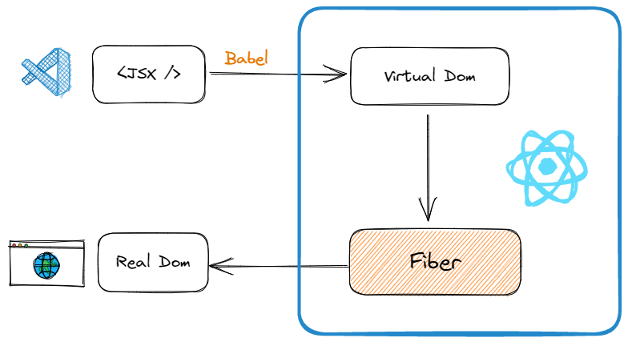

# React

在深入源码之前，我们先澄清几个点：

-   React 本身是一种设计思想，可以用于任何图形界面
-   React-dom 赋予了 React 在浏览器大展身手的机会
-   React 本身不认识 JSX 写法，需要 Babel 把它转化为原生格式

## 我们说的 React 包含了哪些子模块？

React 的官方仓库是一个 monorepo，里面包含了很多子模块。

先从最基本的结构入手，我们会一步步扩展这个图片。



## Fiber

Fiber 是 React 的重新实现，它将组件的渲染拆分成可变更的阶段，使得 React 可以有更多的控制权，更好地支持动画和更复杂的 UI 组件，以及更好地支持异步渲染。Fiber 还可以把 React 应用的渲染过程拆分成更小的单元，从而改善性能。

简单来讲，Fiber 就是一个对象，里面可以存储各种各样的信息。以类似树的方式组织。

每一个节点其实代表了一个 Work。实际运行中，React 会以**深度优先**的方式逐步完成每个节点代表的任务。

## Diff

React 中最值得称道的部分莫过于 Virtual DOM 与 diff 的完美结合，特别是其高效的 diff 算法，让用户可以无需顾忌性能问题而”任性自由”的刷新页面，让开发者也可以无需关心 Virtual DOM 背后的运作原理，因为 React diff 会帮助我们计算出 Virtual DOM 中真正变化的部分，并只针对该部分进行实际 DOM 操作，而非重新渲染整个页面，从而保证了每次操作更新后页面的高效渲染，因此 Virtual DOM 与 diff 是保证 React 性能口碑的幕后推手。

## FAQ

理解了源码概念后，我们可以探讨一些深入的问题。

### React 19 和 React 18 的区别

React 19 引入了新的并发模式，使得 React 可以更好地处理并发任务，从而提高性能。

### 为什么不能在 IF 语句中使用 Hooks？

由于函数组件没有 this，为了能够处理组件内部的状态以及副作用，提供了 Hooks 的方式。

在 React 内部，所有的 Hook 信息可以简单的理解为是在一个数组内维护的，例如 useState 的值，useEffect 的依赖值。每个 Hook 都有一个索引，在触发的时候去对应位置存储相关信息。

如果放在 IF 中，那么这个数组长度就会变化（某些 Hook 可能不执行，也可能执行），这就会导致其他 Hook 索引对应错误。

### useEffect 和 useLayoutEffect 的区别？

与 useEffect 用法类似，但是内部的执行函数为同步执行，会阻塞浏览器渲染。

具体执行时机为：

1. React 更新 DOM
2. React 调用 useLayoutEffect
3. 浏览器绘制屏幕
4. React 调用 useEffect

### useMemo 和 useCallback 的区别？各自在什么场景下使用？

首先，没必要缓存所有的值或者函数，React 本身已经做了很好的优化（Fiber）。

其次，useCallback 本质上是 useMemo 的语法糖。也就是说，以下两种写法本质上是一样的：

```js
React.useCallback(function helloWorld() {}, []);
React.useMemo(() => function helloWorld() {}, []);
```

一些最佳实践包括：

-   在一般的自定义 Hook 中，使用 `useCallback`
-   对于繁重的计算任务，使用 `useMemo`
-   在 Context Provider 中，使用 `useMemo` 缓存需要提供的值

### 如何使用 Hook 实现 componentWillUnmount 方法

```js
function MyComponent() {
	useEffect(() => {
		// This function is equivalent to componentDidMount
		console.log("Component mounted");

		// The return function is equivalent to componentWillUnmount
		return () => {
			console.log("Component will unmount");
		};
	}, []);

	return <div>My Component</div>;
}
```

## 子组件没有任何的 props，父组件在渲染的时候，子组件会跟着渲染吗

子组件默认情况下也会跟着重新渲染。

### 为什么推崇函数式组件

-   代码更少，简洁易读
-   不需要去管 this 绑定
-   纯函数更容易测试

## 扩展阅读

-   [YouTube](https://www.youtube.com/watch?v=1VVfMVQabx0)
-   [Blog](https://www.joshwcomeau.com/react/usememo-and-usecallback/#inside-context-providers-8)
